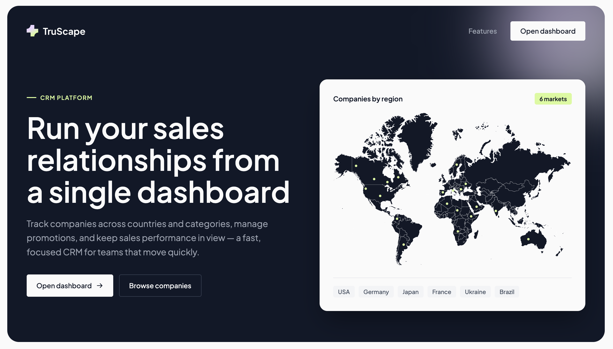
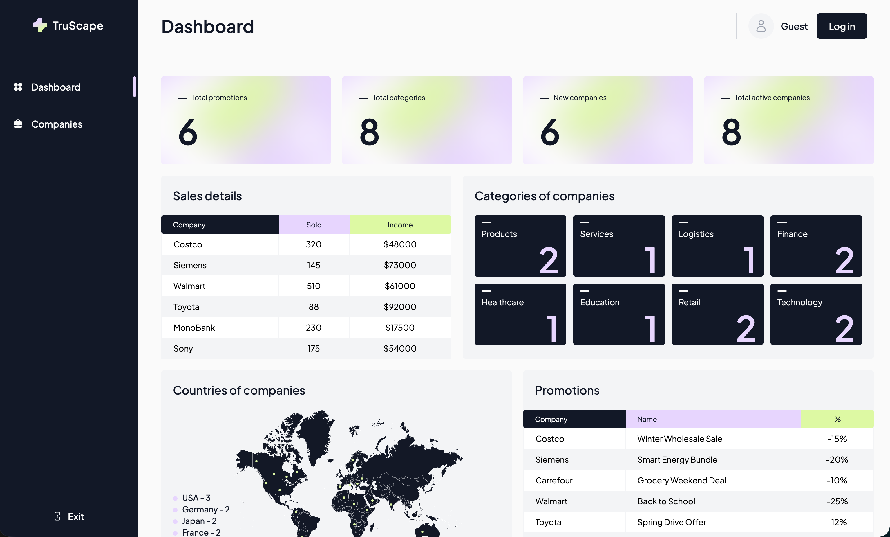
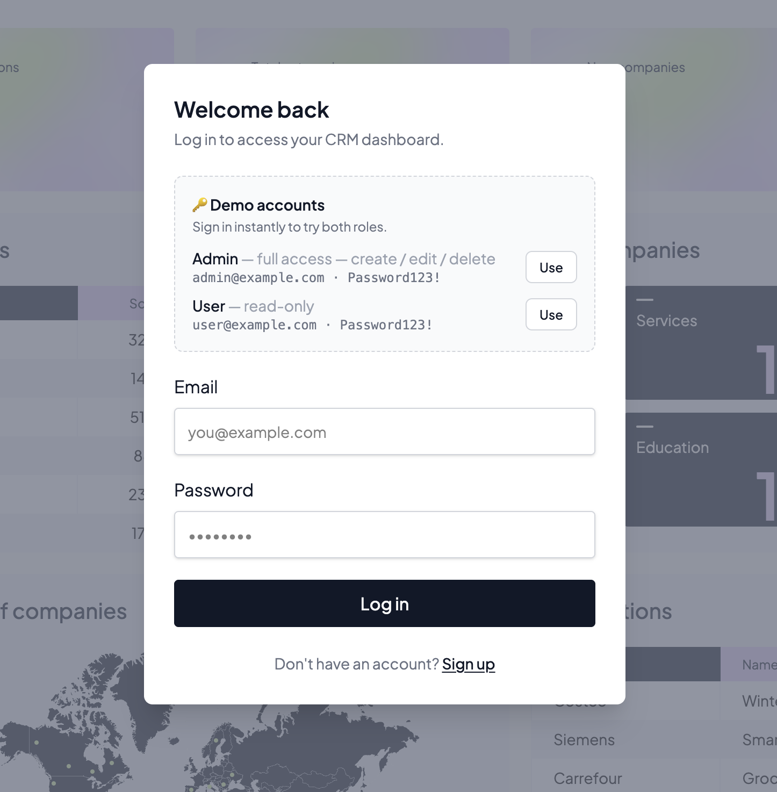
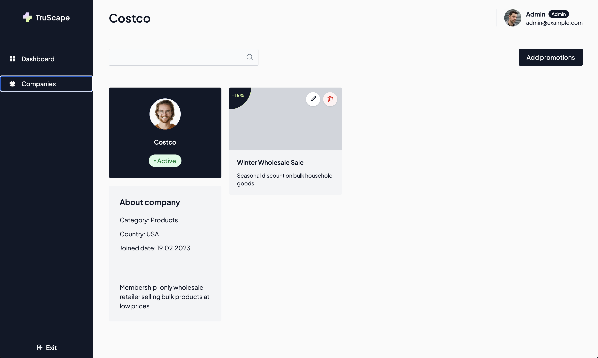

# crm-nextjs

[](https://github.com/InnaIvBoiko/crm-nextjs/actions/workflows/ci.yml)
[](LICENSE)

A CRM dashboard built with the Next.js App Router — a public landing page, mock
authentication with **Admin / User roles**, a metrics dashboard, and full CRUD
for companies and promotions backed by a Postgres database.

**🔗 Live demo:** <https://crm-nextjs-six.vercel.app>

## Screenshots

| Landing page | Dashboard |
| --- | --- |
|  |  |

| Login with demo roles | Company detail (admin) |
| --- | --- |
|  |  |

## Tech stack

- **Next.js 16** (App Router, Turbopack) + **React 19**
- **TypeScript 5**
- **Tailwind CSS v4**
- **Postgres** (Neon serverless) + **Drizzle ORM** — typed schema, migrations, queries
- **TanStack React Query 5** — server state / caching
- **Formik** — forms
- **Headless UI** — accessible UI primitives (modals, accordion)
- **Vitest** + React Testing Library — unit tests

## Features

- **Landing page** (`/`) — public page with a hero, feature cards and a FAQ
- **Authentication** — mock login / registration; the header shows the signed-in
  user or a "Guest" state (see [Authentication](#authentication))
- **Dashboard** (`/dashboard`) — metrics assembled from parallel route slots
- **Companies** — list, detail, create, edit and delete
- **Promotions** — create, edit and delete promotions per company
- **Image upload** — company logos and promotion images (stored as data URLs)
- Create / edit forms open as modals via intercepting routes, with full-page
  fallbacks for direct navigation or refresh

## Requirements

- Node.js **20.9** or later
- npm
- A Postgres database (a free [Neon](https://neon.tech) project works out of the box)

## Getting started

```bash
npm install

# 1. Configure env
cp .env.example .env.local
# then edit .env.local and set DATABASE_URL to your Postgres connection string

# 2. Create the tables and seed sample data
npm run db:migrate
npm run db:seed

# 3. Run the app
npm run dev
```

The app runs at <http://localhost:3000>.

### Scripts

| Command         | Description                                  |
| --------------- | -------------------------------------------- |
| `npm run dev`   | Start the dev server                         |
| `npm run build` | Production build                             |
| `npm run start` | Serve the production build (run build first) |
| `npm run lint`  | Run ESLint                                   |
| `npm run typecheck` | Type-check with `tsc --noEmit`           |
| `npm test`      | Run the Vitest suite once                    |
| `npm run test:watch` | Run Vitest in watch mode                |
| `npm run db:generate` | Generate a SQL migration from the schema |
| `npm run db:migrate` | Apply pending migrations to the database  |
| `npm run db:seed`   | Seed the database with sample data         |
| `npm run db:studio` | Open Drizzle Studio (browse the data)      |

## Environment

Configuration lives in `.env.local` (see [`.env.example`](.env.example)):

| Variable                   | Default                 | Description                                                                                                                     |
| -------------------------- | ----------------------- | ------------------------------------------------------------------------------------------------------------------------------- |
| `NEXT_PUBLIC_API_BASE_URL` | `http://localhost:3000` | Absolute base URL of the API. Server Components fetch the route handlers with full URLs, so this must point at the running app. |
| `DATABASE_URL`             | —                       | Postgres connection string used by Drizzle in the route handlers. **Required.**                                               |

When deploying, set both on the host — see [Deployment](#deployment).

## Project structure

```
src/
├── app/                          # App Router
│   ├── page.tsx                  # Public landing page (static)
│   ├── (admin)/                  # Admin route group (rendered dynamically)
│   │   ├── dashboard/            # Metrics dashboard — parallel slots:
│   │   │                         #   @stats @sales @categories @countries @promotions
│   │   └── companies/            # Company list / detail / create / edit
│   │       ├── @header @toolbar @modal           # Parallel slots
│   │       ├── new/                              # Create company
│   │       └── [id]/
│   │           ├── edit/                         # Edit company
│   │           ├── new-promotion/                # Create promotion
│   │           └── edit-promotion/[promotionId]/ # Edit promotion
│   ├── api/v1/                   # Route handlers (the HTTP API over the DB)
│   └── components/               # Shared UI components
└── lib/
    ├── api.ts                    # Typed fetch helpers + domain types
    ├── db/                       # Database layer (Drizzle)
    │   ├── schema.ts             # Tables + enums
    │   ├── index.ts              # Neon-backed Drizzle client
    │   ├── queries.ts            # Data-access functions used by the route handlers
    │   └── seed.ts               # Seed script (npm run db:seed)
    ├── mock-data.ts              # Sample data — source for the seed script
    └── utils/                    # getQueryClient, getCountById
```

## Architecture

A few Next.js App Router features are used deliberately — here is the reasoning
behind each, not just that they're used.

### Parallel routes (the dashboard & companies slots)

The dashboard is composed of independent slots — `@stats`, `@sales`,
`@categories`, `@countries`, `@promotions` — instead of one page that fetches
everything. Each slot:

- **streams in on its own** with its own `loading.tsx`, so a slow query (e.g.
  sales aggregates) never blocks the rest of the dashboard from painting;
- **fails in isolation** with its own `error.tsx`, so one broken widget degrades
  to an error card instead of taking down the whole page.

The companies screen uses the same idea for its `@header`, `@toolbar` and
`@modal` regions.

### Intercepting routes (modals with a real URL)

Create/edit screens exist as **real routes** (`/companies/[id]/edit`,
`/companies/[id]/new-promotion`, …) *and* as intercepting routes inside the
`@modal` slot (`(.)edit`, …). The payoff:

- **soft navigation** (clicking Edit) intercepts and renders the form as a
  **modal over the current page** — fast, no context lost;
- a **direct visit or refresh** of the same URL renders the **full page** —
  so every modal is shareable, bookmarkable and reload-safe.

One form component backs both; the modal just wraps it.

### Data flow

```
Client component ──React Query──▶ Route handler (/api/v1) ──Drizzle──▶ Postgres
                                       ▲
Server component ──fetch(absolute)─────┘
```

The route handlers are the single HTTP API over the database; both Server
Components (via `fetch`) and Client Components (via React Query) go through them,
so caching, mutations and invalidation live in one place.

## Database

Data lives in Postgres, accessed through [Drizzle ORM](https://orm.drizzle.team).
The schema ([`src/lib/db/schema.ts`](src/lib/db/schema.ts)) is normalized —
companies reference countries and categories by id, and promotions/sales
reference companies — while the API returns denormalized shapes (titles resolved
via joins, `hasPromotions` derived), so the frontend contract is unchanged.

- **Migrations** live in [`drizzle/`](drizzle) and are generated from the schema
  with `npm run db:generate`, then applied with `npm run db:migrate`.
- **Seed data** comes from [`src/lib/mock-data.ts`](src/lib/mock-data.ts) via
  `npm run db:seed`.
- The data-access functions in [`src/lib/db/queries.ts`](src/lib/db/queries.ts)
  keep the route handlers thin.

## API

Route handlers under [`src/app/api/v1/`](src/app/api/v1) expose the database over
HTTP. They are marked `dynamic = 'force-dynamic'` so every request reads fresh
from Postgres.

| Endpoint                           | Description                                   |
| ---------------------------------- | --------------------------------------------- |
| `GET    /api/v1/summary-stats/:id` | Dashboard summary counters                    |
| `GET    /api/v1/summary-sales`     | Per-company sales summary                     |
| `GET    /api/v1/countries`         | Country list                                  |
| `GET    /api/v1/categories`        | Category list                                 |
| `GET    /api/v1/companies`         | Company list                                  |
| `POST   /api/v1/companies`         | Create a company                              |
| `GET    /api/v1/companies/:id`     | Single company                                |
| `PUT    /api/v1/companies/:id`     | Update a company                              |
| `DELETE /api/v1/companies/:id`     | Delete a company (cascades to its promotions) |
| `GET    /api/v1/promotions`        | Promotion list (filter with `?companyId=`)    |
| `POST   /api/v1/promotions`        | Create a promotion                            |
| `GET    /api/v1/promotions/:id`    | Single promotion                              |
| `PUT    /api/v1/promotions/:id`    | Update a promotion                            |
| `DELETE /api/v1/promotions/:id`    | Delete a promotion                            |

## Authentication & roles

Authentication is a **client-side mock for demo purposes** — it is not real
security. Any credentials are accepted, the session is kept in `localStorage`,
and there is no server-side verification. Do not treat the signed-in state as a
security boundary.

There are two roles:

| Role      | Can do                                  | Demo login                          |
| --------- | --------------------------------------- | ----------------------------------- |
| **Admin** | Browse **and** create / edit / delete   | `admin@example.com` / `Password123!` |
| **User**  | Browse only (read-only)                 | `user@example.com` / `Password123!`  |

The role is derived from the email: the admin demo address is the only admin,
and every sign-up is a read-only user — so nobody can self-promote. The login
modal surfaces both demo accounts with a one-click **Use** button.

Role enforcement is **UI-level** (the create/edit/delete controls are hidden for
non-admins), consistent with the mock nature of the auth. Real per-route or
per-API enforcement would require a real auth backend.

## Deployment

The app builds with `npm run build` and can be deployed to any Next.js host
(e.g. Vercel). Before deploying:

- Set `NEXT_PUBLIC_API_BASE_URL` to the deployment's public URL (e.g.
  `https://your-app.vercel.app`). Otherwise Server Components fetch
  `http://localhost:3000` and the data pages fail. `NEXT_PUBLIC_*` variables are
  inlined at build time, so **redeploy** after changing it.
- Set `DATABASE_URL` to your Postgres connection string (on Vercel: Project →
  Settings → Environment Variables). Run `npm run db:migrate` and `npm run db:seed`
  against that database once before the first deploy.

## Notes

- The `(admin)` section is marked `dynamic = 'force-dynamic'`: its Server
  Components fetch the app's own route handlers, so the pages render per-request
  rather than being statically prerendered at build time.

## License

Released under the [MIT License](LICENSE).
